# openwrt-almond3s

*[English version](README.md)*

Экран **Securifi Almond 3S** под OpenWrt: драйвер 2.8" панели ILI9341 с тачем
SX8650 и приложение, которое показывает на нём сеть, модем, Wi-Fi, трафик и
погоду.

Репозиторий — фид OpenWrt из трёх пакетов:

| Пакет | Что это |
|---|---|
| `kmod-lcd-almond3s` | драйвер ядра: фреймбуфер RGB565 в `/dev/lcd`, тач, батарея через PIC16LF1509 |
| `lcd-ui-almond3s` | юзерспейс: рендерер, демон тача, сборщик данных и сам интерфейс на ucode |
| `nes-almond3s` | эмулятор NES (QuickNES) с джойстиком в браузере по Wi-Fi, ставится по желанию |

## Экраны

<table>
<tr>
<td align="center">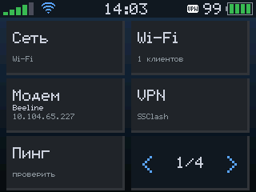<br><sub>Главное меню</sub></td>
<td align="center">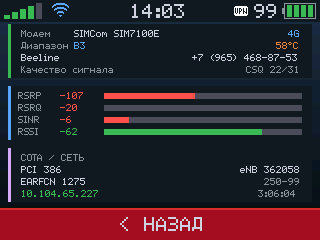<br><sub>Модем: сигнал и сота</sub></td>
<td align="center">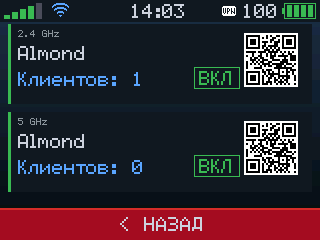<br><sub>Wi-Fi с QR для подключения</sub></td>
</tr>
<tr>
<td align="center">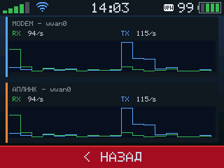<br><sub>Трафик живой кривой</sub></td>
<td align="center">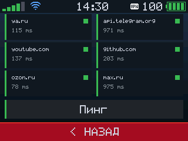<br><sub>Доступность сервисов</sub></td>
<td align="center">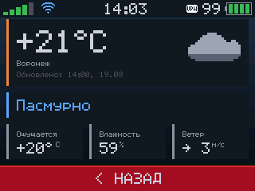<br><sub>Погода</sub></td>
</tr>
<tr>
<td align="center">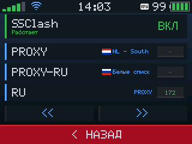<br><sub>VPN: группы SSClash</sub></td>
<td align="center">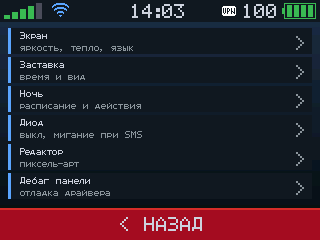<br><sub>Настройки</sub></td>
<td align="center">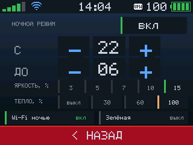<br><sub>Ночное расписание</sub></td>
</tr>
<tr>
<td align="center">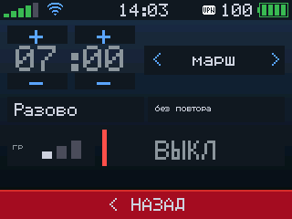<br><sub>Будильник</sub></td>
<td align="center">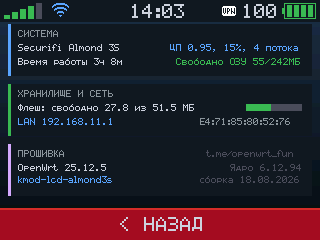<br><sub>О системе</sub></td>
<td align="center">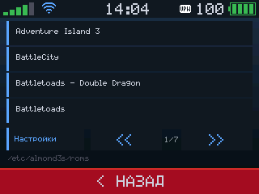<br><sub>Список игр</sub></td>
</tr>
<tr>
<td align="center">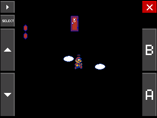<br><sub>Эмулятор NES</sub></td>
<td align="center">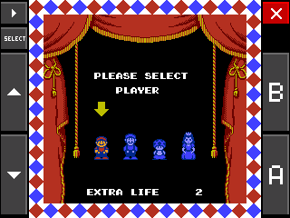<br><sub>Экранный джойстик</sub></td>
<td align="center">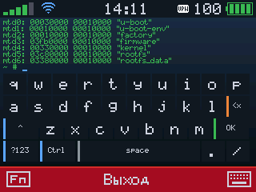<br><sub>Шелл с экранной клавиатурой</sub></td>
</tr>
<tr>
<td align="center">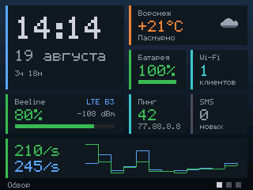<br><sub>Виджеты: обзор</sub></td>
<td align="center">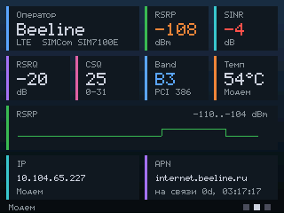<br><sub>Виджеты: модем</sub></td>
<td align="center">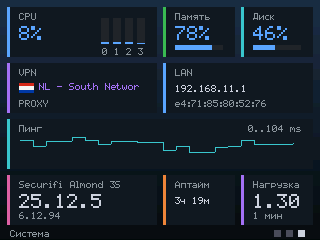<br><sub>Виджеты: система</sub></td>
</tr>
<tr>
<td align="center">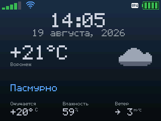<br><sub>Заставка «Погода»</sub></td>
<td align="center">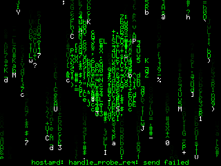<br><sub>Заставка «Матрица»</sub></td>
<td align="center">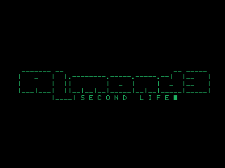<br><sub>Заставка «Лого»</sub></td>
</tr>
</table>

## Что умеет

* **Сеть** — список аплинков (модем, Wi-Fi-клиент, провод) с адресами и
  метриками; тап по карточке делает аплинк основным
* **Wi-Fi** — оба диапазона с числом клиентов, включением и QR-кодом для
  подключения
* **Модем** — оператор, лесенка сигнала с RSRP/RSRQ/SINR/RSSI, бенд, сота,
  температура и вторая страница с деталями соты и соседями
* **SMS** — ящик через `luci-app-5gmodem`: длинные сообщения склеиваются,
  отметки о прочтении синхронны в обе стороны, чтение во весь экран
* **Трафик** — приём и отдача для модема и текущего аплинка живой кривой,
  тап разворачивает график на весь экран
* **Сервисы** — доступность и задержка по своему списку адресов
* **Спидтест** — замер скорости прямо с экрана
* **Погода** — текущая погода с Open-Meteo и выбором города
* **VPN** — SSClash: включение, группы прокси, задержки узлов, переключение
* **Игры** — эмулятор NES (QuickNES): экранные кнопки, USB-клавиатура или
  джойстик в браузере телефона по Wi-Fi, открывается по QR-коду
* **Терминал** — настоящий шелл на панели (`forkpty` + libvterm) с экранной
  клавиатурой: работают `ls`, `cd`, правка строки, `top` и `vi`
* **Будильник** — мелодия, время, разово или по будням; расписание пишется в
  cron, поэтому срабатывает и при спящем экране
* **Батарея** — заряд, состояние зарядки, скорость разряда и остаток времени
* **О системе** — модель, прошивка, ядро, аптайм, нагрузка, память,
  накопитель, LAN
* **Настройки** — яркость, тёплый фильтр, язык, разворот на 180°, иконки меню,
  стиль и таймаут заставки, ночное расписание, диод, редактор иконок, отладка
  панели
* **Заставки** — виджеты (три сменяющиеся страницы карточек), погода с крупными
  часами, просто часы, строка-шапка, «Матрица» и логотип Almond
* **Ночной режим** — расписание: гасит яркость, теплит цвета, переводит
  заставку в зелёный и может выключать точки доступа до утра
* **Питание** — перезагрузка, выключение и рестарт модема из меню

## Железо

* MT7621A, 256 МБ RAM, 64 МБ флеш
* Панель S028HQ29NN (ILI9341), 320×240, 8-битная шина 8080-II битбангом на GPIO 13–18 и 22–27
* Тач-контроллер SX8650 на I²C palmbus
* PIC16LF1509 — заряд батареи, зуммер, светодиод
* Батарея с контроллером заряда BQ24133

## Что нужно

* Поддержка Almond 3S в дереве. В OpenWrt её пока нет —
  [PR #22141](https://github.com/openwrt/openwrt/pull/22141). В DTS обязательно
  должны быть освобождены пины панели, то есть `&state_default` с
  `groups = "jtag", "wdt", "rgmii2"`.
* [`luci-app-5gmodem`](https://github.com/fildunsky/luci-app-5gmodem) —
  **не обязателен, но желателен**. Из него берутся метрики модема, пинги
  сервисов и признак непрочитанных SMS. Без него экран работает, просто эти
  карточки пустые.
* `qrencode` — тянется зависимостью, нужен для QR-кода Wi-Fi.

## Установка

### Готовыми пакетами

В `prebuilt/25.12.5/` лежат пакеты, собранные под **OpenWrt 25.12.5**
(`r33051-f5dae5ece4`, ядро 6.12.94):

```sh
scp prebuilt/25.12.5/*.apk root@192.168.1.1:/tmp/
ssh root@192.168.1.1
apk add --allow-untrusted /tmp/kmod-lcd-almond3s-*.apk /tmp/lcd-ui-almond3s-*.apk
reboot
```

`nes-almond3s-*.apk` — эмулятор NES, ставится отдельно и по желанию: без него
страница «Игры» скажет, что эмулятор не установлен.

**Модуль ядра привязан к конкретной сборке ядра** (vermagic). На другой версии
OpenWrt готовый `kmod` просто не загрузится — там нужно собрать его из
исходников, как описано ниже. Сам `lcd-ui-almond3s` к ядру не привязан и ставится на
любую 25.12.x.

### Сборкой из исходников

```sh
echo "src-git almond3s https://github.com/fildunsky/openwrt-almond3s.git" >> feeds.conf.default
./scripts/feeds update almond3s
./scripts/feeds install -a -p almond3s
```

Дальше в `make menuconfig`:

* `Kernel modules` → `Video Support` → `kmod-lcd-almond3s`
* `Utilities` → `lcd-ui-almond3s`

и `make package/feeds/almond3s/lcd-almond3s/compile package/feeds/almond3s/lcd-ui-almond3s/compile`
либо обычная сборка образа целиком.

Когда правишь код, удобнее направить фид на локальную копию, а не на GitHub, -
тогда сборка подхватывает правки без пуша:

```
src-link almond3s /home/user/openwrt-almond3s
```

## Настройка

Всё лежит в `/etc/config/almond3s`, и почти всё то же самое доступно с самого экрана,
через `Меню → Ещё → Экран`:

```sh
uci set almond3s.display.lang='ru'          # ru | en
uci set almond3s.display.saver='60'          # секунды до заставки, 0 - выключить
uci set almond3s.display.saver_style='clock' # clock (часы) | full (погода) | line | off (гасить экран)
uci set almond3s.display.night='1'           # ночной режим заставки
uci set almond3s.display.night_from='22'      # с какого часа
uci set almond3s.display.night_to='6'         # до какого часа
uci set almond3s.weather.city='Voronezh'
uci commit almond3s
/etc/init.d/almond3s-lcd restart
```

`saver_style=off` вместо заставки гасит панель: подсветка снимается ioctl'ом
драйвера, перерисовка останавливается, а тап по тёмному экрану будит обратно.
То же самое доступно руками и вешается на любую кнопку, у которой есть события:

```sh
/etc/almond3s/scripts/screen.sh off|on|toggle

# /etc/rc.button/tamper
[ "$ACTION" = released ] && [ "$SEEN" -lt 2 ] && /etc/almond3s/scripts/screen.sh toggle
```

Гасим не своим ioctl'ом драйвера, а светодиодом подсветки из DTS (GPIO 31,
`/sys/class/leds/:power`). Пин один и тот же, но через светодиод ядро остаётся
при верном значении `brightness` - иначе ближайшая перезагрузка триггеров
светодиода зажгла бы панель сама. ioctl (`almond3s-lcd b 0|1`) остался запасным
путём на случай, если светодиода в DTS нет. Кнопка «Погасить» на странице
«Экран» делает то же самое по требованию.

**Кнопка питания программе недоступна**: она заведена на PIC, нажатие
обрабатывает его прошивка, и до ядра короткое нажатие не доходит вообще. До ядра
доходят только `reset` (GPIO 32, `linux,code = KEY_RESTART`) и `tamper`
(GPIO 28, `BTN_0`). Имя скрипта в `/etc/rc.button/` при этом берётся из кода
клавиши, а не из метки в DTS: тампер запускает `/etc/rc.button/BTN_0`.

Погоду забирает `/etc/almond3s/scripts/weather_fetch.sh` с wttr.in, пинги сервисов —
`/etc/almond3s/scripts/svcping.sh`; оба ставятся в cron при установке пакета.

## Подробности по страницам

Список страниц выше, а здесь то, что стоит знать сверх него:

* **Диод** — белый светодиод над экраном: включить, выключить и мигание, пока
  есть непрочитанные SMS. Он висит не на GPIO, а на PIC (порт E, бит 4), и
  управляется командой `almond3s-lcd led on|off|blink`
* **Звук** — пищалка, тоже на PIC (порт C, бит 0). Заводские тоны вынуты из
  стоковой прошивки: `almond3s-lcd bell` (дверной звонок, 1975/1675 Гц),
  `ambulance`, `police`, плюс `tone <Гц> <мс> ...` до 64 нот и
  `volume 1..3`
* В шапке появляется конвертик, когда в `luci-app-5gmodem` есть непрочитанные SMS

В шрифте 5x7, кроме латиницы и кириллицы, есть пунктуация, которая реально
встречается в SMS операторов и на страницах: `° « » № ₽ → ← ↑ ↓ ↖ ↗ ↘ ↙ • ✓ … – — “ ” ‘ ’`.
Всё остальное рисуется пробелом, а не мусором.

Драйвер шлёт на панель только изменившиеся строки, а интерфейс перерисовывает
страницу лишь когда на ней что-то поменялось. В покое кадров нет вообще: полная
перерисовка стоила 75 мс протяжки, и на приглушённой подсветке она была видна
как мерцание.

## Отладка вёрстки

`almond3s-lcdshot` выгружает фреймбуфер в PPM — видно ровно то, что на панели, без
фотографирования экрана:

```sh
ssh root@192.168.1.1 almond3s-lcdshot > shot.ppm
```

## Чего пока нет

* Полный флаш кадра занимает ~75 мс: шина битбангом, и драйвер перерисовывает
  весь экран. Обновление только изменившихся строк — в планах.
* Яркость меняется **цифровым затемнением**: драйвер масштабирует пиксели при
  отправке на панель, а подсветка горит ровно. Шаги на странице «Экран» -
  10/20/35/50/70/85/100 %, руками - `almond3s-lcd gray 0..255`; оба уровня
  показывает `almond3s-lcd level`. Ночью заставка приглушается дополнительно.

  В драйвере есть и программный ШИМ подсветки (`almond3s-lcd dim 0..255`,
  GPIO 31 через hrtimer), он даёт настоящую темноту и используется для полного
  гашения экрана. Для плавной регулировки он не годится: панель обновляется
  постепенно, и моргающая подсветка показывает её в разных стадиях - это видно
  как мерцание при каждой перерисовке. Заводская прошивка яркость не умела
  вовсе: её «BackLight Settings» задаёт лишь часы, когда подсветка горит.
* Zigbee (EM357) доступен, но не поддержан: чип отвечает по `/dev/ttyS2` на
  57600 и представляется как EZSP v4 (EmberZNet 5.1.0), а этого современные
  координаторы не принимают. Сирена тоже не поддержана.
* Драйвер работает с блоком GPIO напрямую, мимо pinctrl, — поэтому это пока
  пакет фида, а не патч в апстрим.

## Благодарности

* Драйвер панели вырос из исследований и кода
  **[iSublimity](https://github.com/isublimity/Securifi-Almond-3S)** — тайминги
  шины, протокол PIC и последовательность инициализации SX8650 оттуда.
* Вёрстка интерфейса основана на
  **[zipfo/almond-lcd-menu](https://github.com/zipfo/almond-lcd-menu)**, оттуда
  же идея виджета погоды.

## Лицензия

GPL-2.0-only, как и сам OpenWrt.
